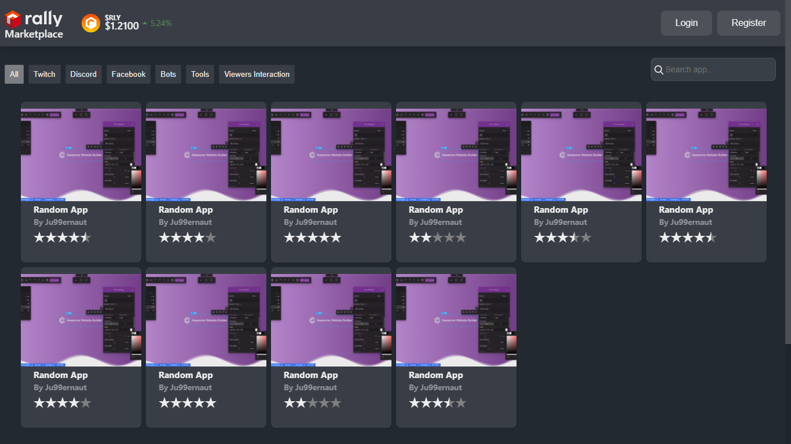

# App Listing

[](https://app.netlify.com/sites/rally-community-app-listing/deploys)

Next.js template for app-listing webapp built to work with [app-listing-server](https://github.com/Ju99ernaut/app-listing-server). Built mainly as an app for listing rally, developer community projects.



[](https://app.netlify.com/start/deploy?repository=https://github.com/Ju99ernaut/app-listing)

## To Do
- [x] Connect to backend.
- [x] Fix mobile version.
- [ ] Markdown dark mode.
- [ ] Notifications.
- [ ] Session mgnt.
- [ ] All API actions

## Configuring

Clone the repo

```sh
$ git clone https://github.com/Ju99ernaut/app-listing-server.git
$ cd app-listing-server
```

Install dependencies
```sh
$ yarn install
```

Edit `config.js` and add your `apiEndpoint` or add it as the `API_ENDPOINT` enviroment variable, which is the endpoint for [app-listing-server](https://github.com/Ju99ernaut/app-listing-server).

## Available Scripts

In the project directory, you can run:

### `yarn dev`

Runs the app in the development mode.\
Open [http://localhost:3000](http://localhost:3000) to view it in the browser.

The page will reload if you make edits.\
You will also see any lint errors in the console.

### `yarn start`

Runs the app in the production mode.\
Open [http://localhost:3000](http://localhost:3000) to view it in the browser.

### `yarn build`

Builds the app for production to the `out` folder.\
It correctly bundles React in production mode and optimizes the build for the best performance.

The build is minified and the filenames include the hashes.\
Your app is ready to be deployed!